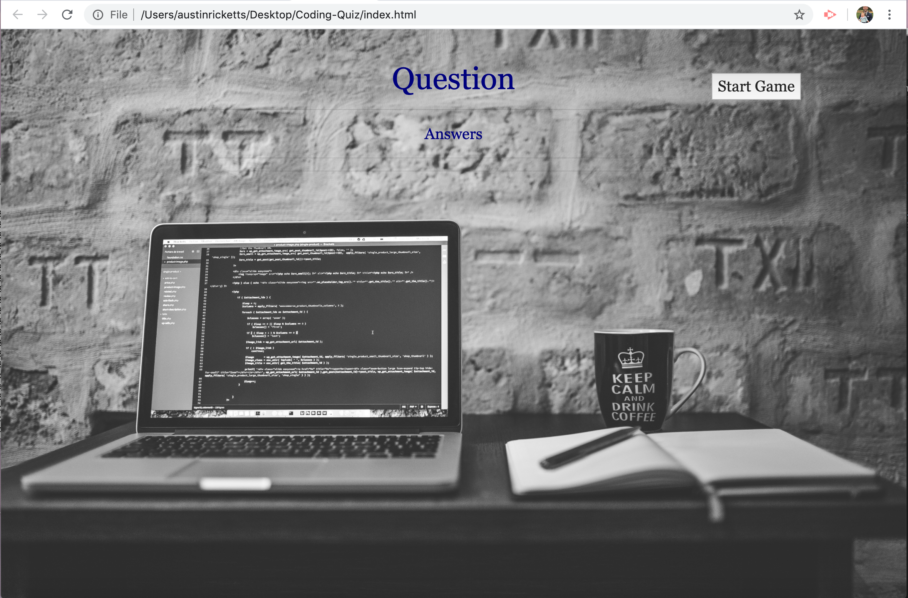
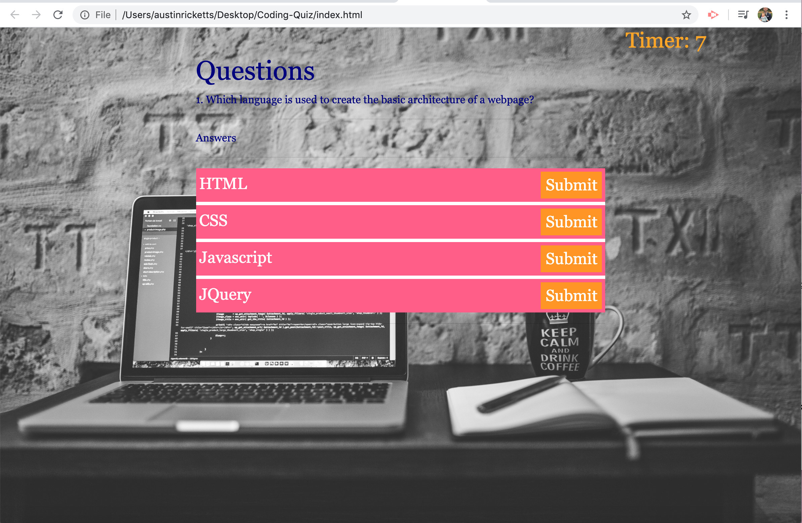
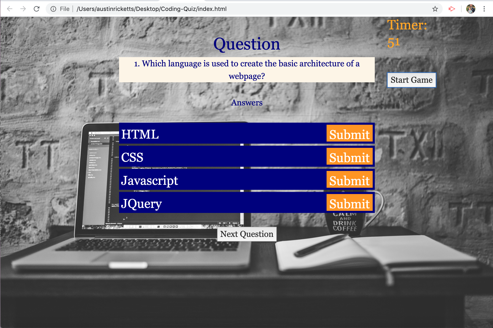

# Coding-Quiz

The goal of this website was to create a game, wherein the user could answer basic questions about coding. There are five questions. There is a serious answer for all of them, though many of the answers are silly and meant to give a laugh.

To start the game, you press the 'Start Game' button. This launches the timer. The user has 60 seconds to play the game. The goal is to complete all of the questions correctly in the shortest amount of time.